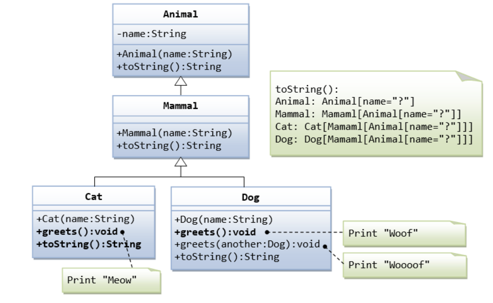
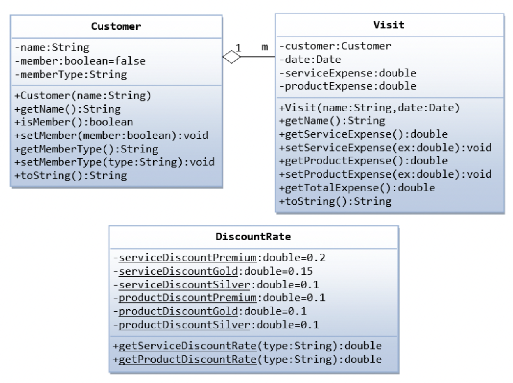

# Programming 2 - Lab 9

This template repository is the starter project for Programming 2 Lab 9. Written in Java, and tested with Gradle/JUnit.

### Question(s)

1. Implement the following classes along with their driver class based on the UML class diagrams:

2. Implement the following classes along with their driver class based on the UML class diagrams:

